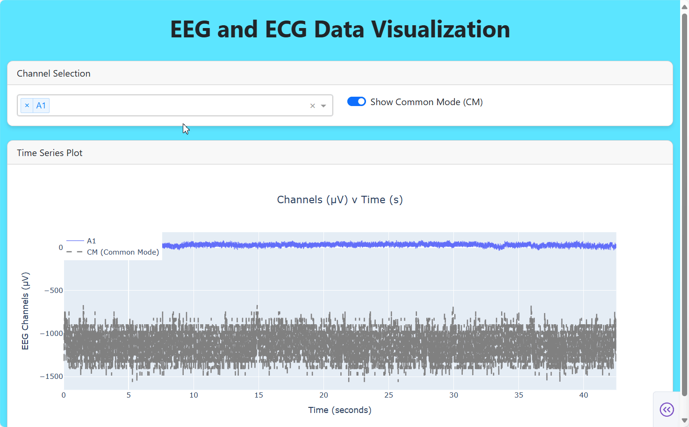

# EEG & ECG Visualization App



## Installation

Install dependencies with:

```bash
python -m pip install dash dash-bootstrap-components plotly pandas
```

Run from within the directory using

```bash
python app.py
```

Once running navigate to local site hosting (http://127.0.0.1:8050/)

## Design Choices:

1. Used Plotly and Dash due to built-in zoom and image capture for graphs

   - Additionally has similarities to/built on Flask and React.JS which I have experience with

2. Handled EEG vs ECG scaling by having two separate y-axises, one on the left, one on the right
3. Separated CM from other channels with individual toggle button
4. Decided to sort channels in selection dropdown alphabetically, with ECG options last
5. Minimalistic CSS - didn't want to take away from the core functionality

## Future Work

- Toggle between uV and mV
- Move ECG y-index to left if none of the EEGs are shown
- Add extra graphs showing only ECG and only EEG
- Cooler CSS ("tinted window fade-away effect at bottom of screen, add icons, change fonts, more specific colorings etc")

## AI Use:

Structure is my own, learned Dash and Plotly through watching ["Introduction to Plotly" video by Code with Josh](https://www.youtube.com/watch?v=ArnxeE1NuMM).  
Took ~1:30 hrs to code main functionality, with additional time on write up, testing and small style changes
Used AI for instructions on how to change specific stylings and which options on some variables could be used to change appearance/functionality.

## Final Thoughts:

Honestly had a lot of fun learning and using Plotly and Dash, didn't know about these tools before, looking forward to using them in the future, in my own projects or elsewhere.
Thanks for reading!
